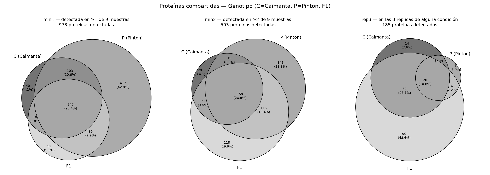
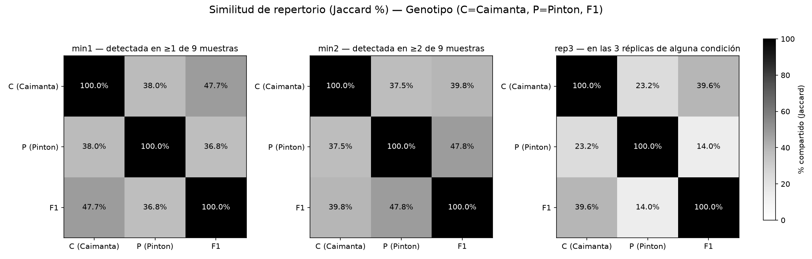
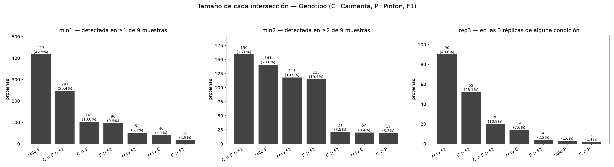
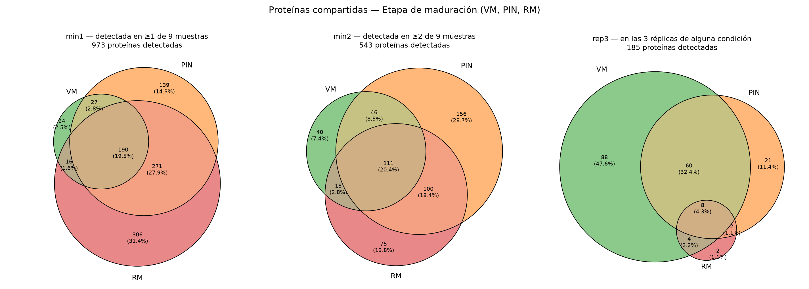
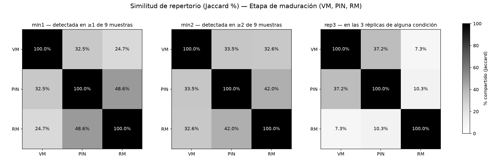
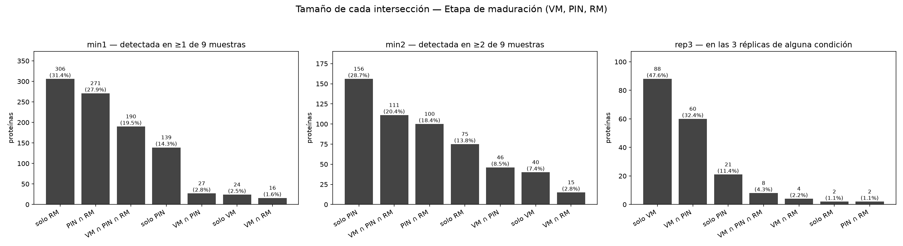
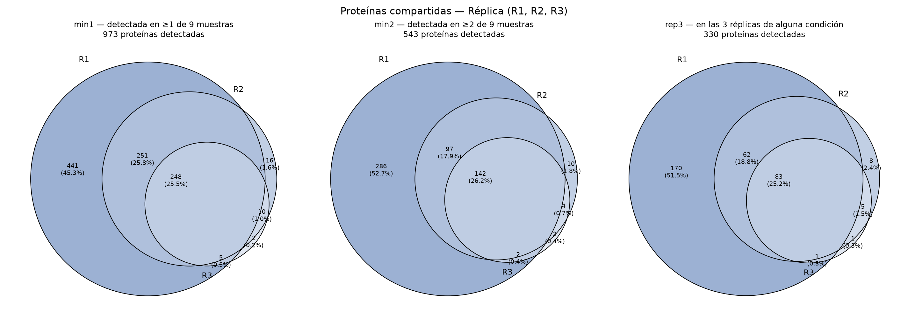
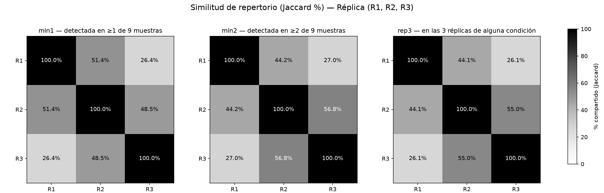
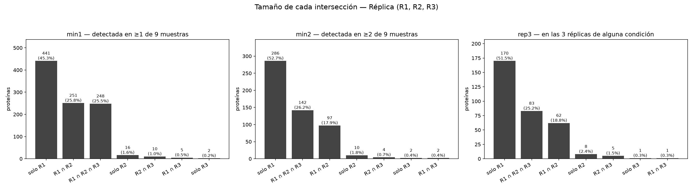

# Análisis cualitativo — las tres reglas en paralelo

Mismos datos, misma cuenta: **qué proteínas se detectan** (valor ≠ 0) en cada grupo.
Lo único que cambia entre columnas es cuán exigente es la regla para decir "presente":

| regla | exige |
|-------|-------|
| `min1` | detectada en ≥1 de las 9 muestras del grupo |
| `min2` | detectada en ≥2 de las 9 muestras del grupo |
| `rep3` | detectada en las 3 réplicas de alguna condición (en réplica: ≥3 de 9) |

Números en `tables/resumen_reglas.csv`. Lectura e interpretación:
`../cualitativo_comparacion_reglas.md`.

---

## Genotipo — C (Caimanta), P (Pinton), F1







---

## Etapa de maduración — VM, PIN, RM







---

## Réplica — R1, R2, R3







---

## Carpetas del análisis cualitativo

| carpeta | qué tiene |
|---------|-----------|
| `results/cualitativo_min1/` | figuras y tablas de una sola regla (`min1`) |
| `results/cualitativo_min2/` | ídem con `min2` |
| `results/cualitativo_rep3/` | ídem con `rep3` |
| `results/cualitativo_comparado/` | las tres reglas en un mismo gráfico (esta carpeta) |

Regenerar:

```
python scripts/run_qualitative.py --presence-rule min1   # y min2, rep3
python scripts/compare_qualitative_rules.py              # paneles comparativos
```
